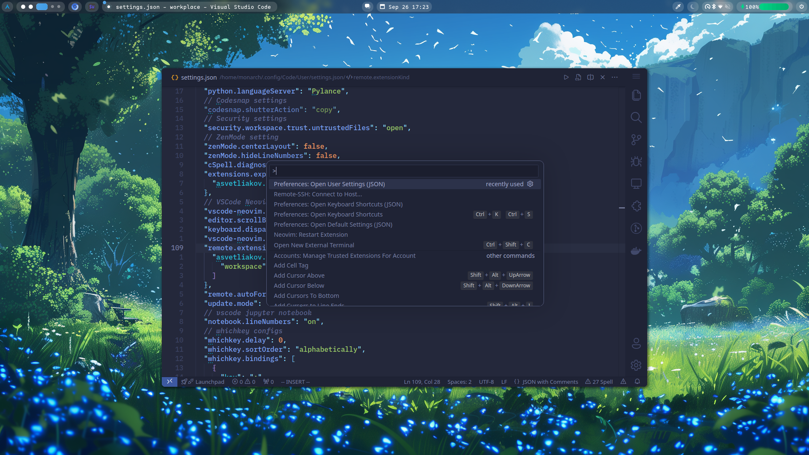

> [!NOTE]
> To make apc work in linux use this to change the file's owner `sudo chown -R $(whoami) /usr/share/code`
> if you use arch(i use arch, btw!) you should run this `sudo chown -R $(whoami) /opt/visual-studio-code`
